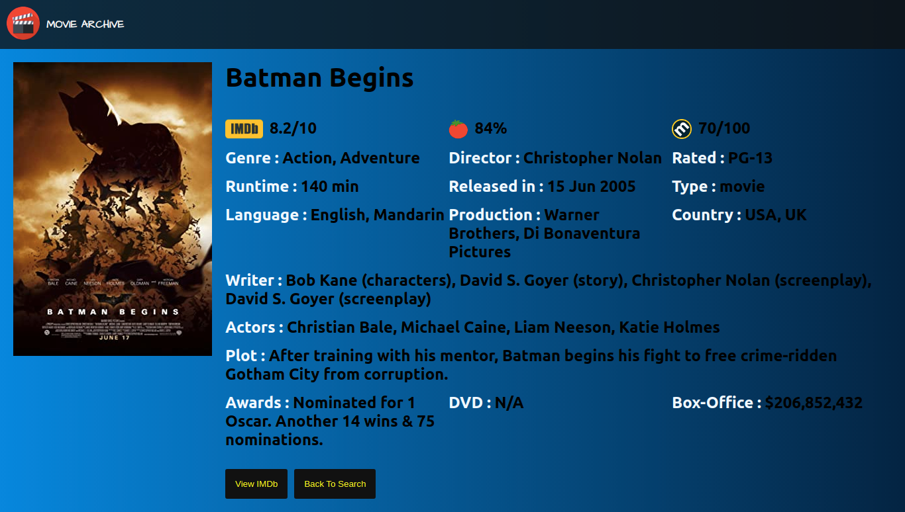

# Movie-Archive
### This application gives you information about any movie!

## Tech Stack used:

<code></code>
<code></code>
<code></code>
<code></code>

## Main Page:
- Search for any movie in the input box and press Enter.

## Listing Page:
- Shows you a list of movies according to our search query.
- Click on "More Info" to see more info about any movie

## Movie Details Page:
- Shows more information about the selected movie.
- Click "View IMDb" to see it's IMDb page.
- Click "Back to Search" to return to Listing Page.

## Sneak Peak:

## Acknowledgments:
I take full responsiblity for every single line of code.

